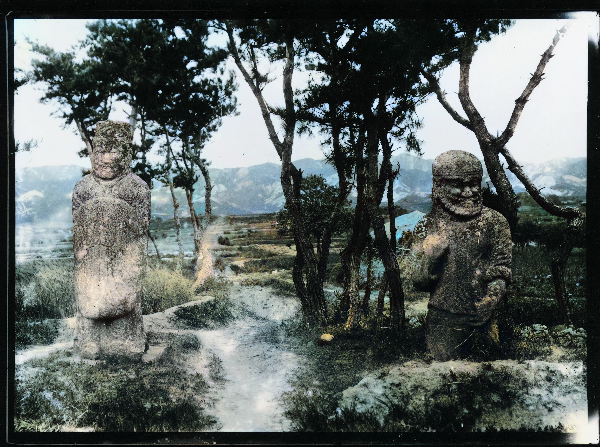
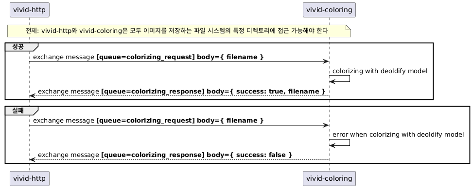
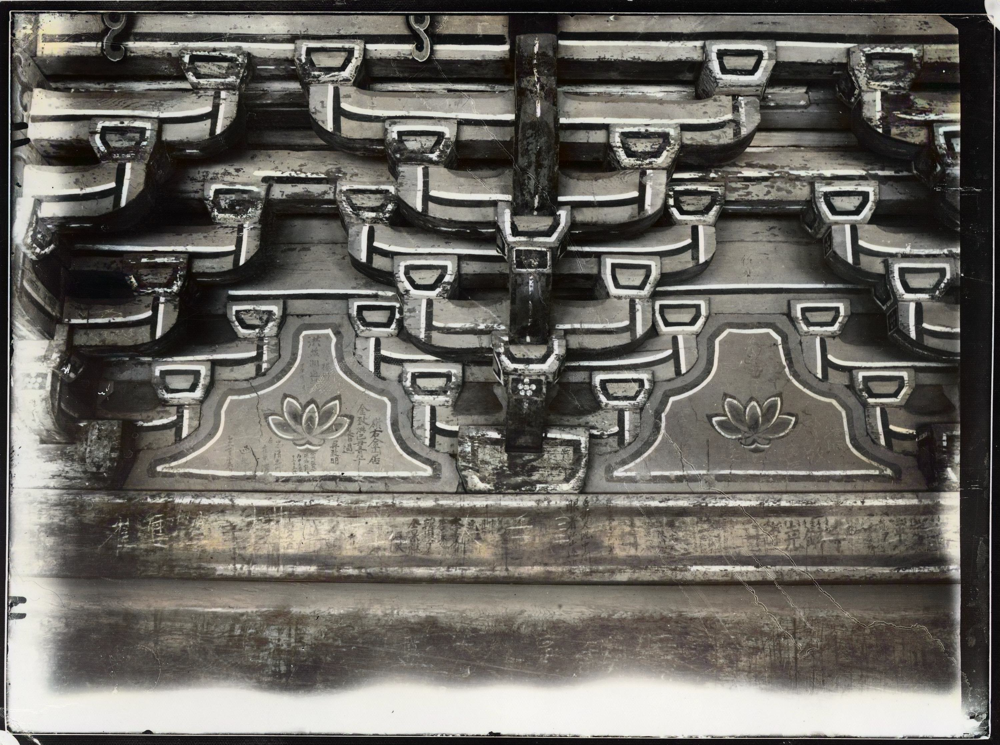
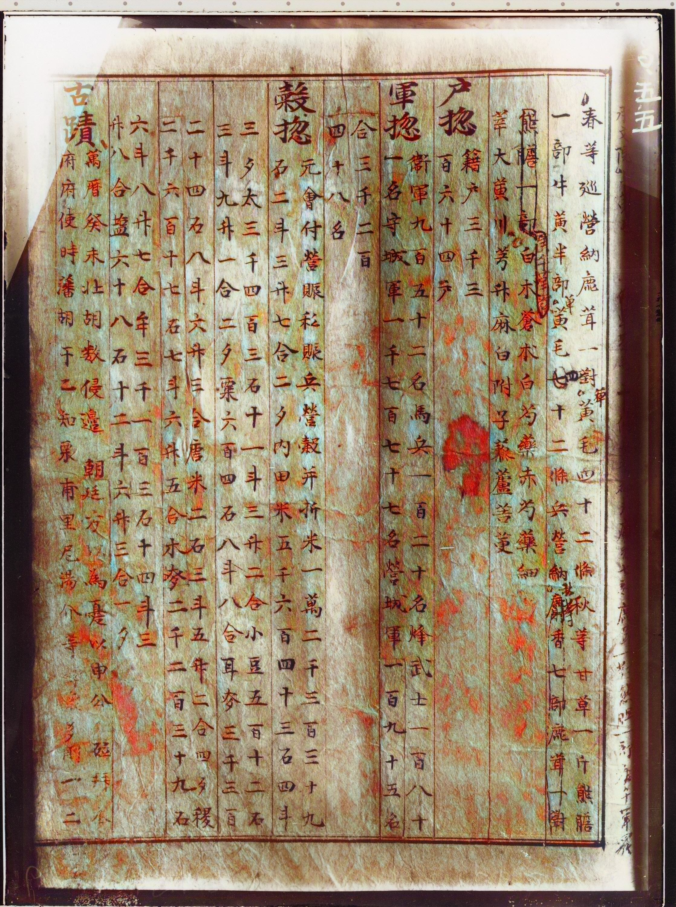

# vivid-dry-plate

[국립중앙박물관 소장 유리건판](https://www.museum.go.kr/dryplate/main.do) 자료  
딥러닝 모델 활용 컬러라이징 파이프라인 구성 및 사용자 경험 향상 프로젝트


  
[건판 3955](https://www.emuseum.go.kr/detail?relicId=PS0100100102000395500000)  

## 구조

- RabbitMQ를 통해 컬러라이징 서버와 HTTP API 서버가 통신
- 

## Instruction

### 1. RabbitMQ 준비

```
docker compose -f docker-compose.dev.yml up -d
```

### 2. 컬러라이징 서버

```
pushd vivid-coloring

conda env create -f ./environment.yml
conda activate deoldify

# pth 다운로드
# https://github.com/jantic/DeOldify#pretrained-weights 중 Artistic 선택
cp your-download-path/ColorizeArtistic_gen.pth ./models/

# .env 복사, 수정
cp .env.example .env
YOUR_EDITOR .env

python ./main.py

popd
```

### 3. HTTP API 서버

```
pushd vivid-http

# 환경변수 설정 후 직접 빌드하여 실행하거나 IDE로 실행
./vivid-http/gradlew bootJar

EMUSEUM_SERVICE_KEY=your-emuseum-service-key;RABBITMQ_HOST=localhost;RABBITMQ_PASSWORD=admin;RABBITMQ_PORT=5672;RABBITMQ_USERNAME=admin;IMAGES_ROOT_PATH=/Users/limo/Git/vivid-dry-plate/images java -jar ./vivid-http/build/libs/vivid-http-0.0.1-SNAPSHOT.jar

popd
```

### 4. 프론트엔드

```
pushd vivid-front

# .env 복사, 수정
cp .env.example .env
YOUR_EDITOR .env

pnpm install
pnpm run dev

popd
```

## 구조


## 알려진 문제와 해결할 점

- 프론트엔드에서 SSE 재연결을 계속 시도
- 에지 케이스 검증 미비
- e뮤지엄 API 요청하는 부분에 캐시 필요
- AI 모델 한계
  - 한국의 문화유산 이미지로 학습된 모델이 아니기 때문에 컬러라이징에 한계가 있음
  - 예시
    - [[건판 1]](https://www.emuseum.go.kr/detail?relicId=PS0100100102000000100000) 단청과 바탕의 목재 색상이 구분되지 못함  
      
    - [[건판 3013]](https://www.emuseum.go.kr/detail?relicId=PS0100100102000301300000) 문자 주변이 붉게 얼룩지게 채색됨
      
    - [건판 11808](https://www.emuseum.go.kr/detail?relicId=PS0100100102001180800000) 레이블에 따르면 청화로 시문된 자기인데, 마치 동채처럼 붉게 채색됨
      ![[건판 11808]](./docs/example2.jpg)

    
